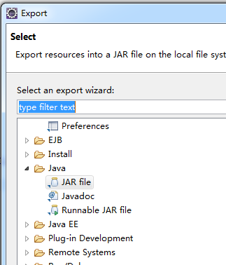
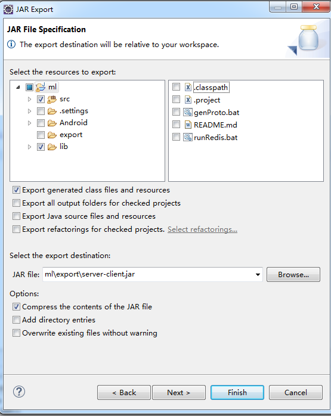

## Client-Server

A java socket server and client

support both java and android application.

-------------------

### USAGE:

edit proto/menglei/*.proto then, generate java codes by run `genProto.bat`

`server side`

export\run-server.bat

`client side`

export\run-client.bat

-----------------------------
How to export `export\server-client.jar`

1. run `genProto.bat` to generate the proto-java-class files

2. right-click on the project and select "export"

3. choose "Java" "JAR file"

4. select `src` and `lib` dir, then click finish

-------------------------------------

约定：定义的proto文件不可以写在一行，“message”单独占一行，可以有“{”

* Jedis : https://github.com/xetorthio/jedis
* wire : https://github.com/square/wire
